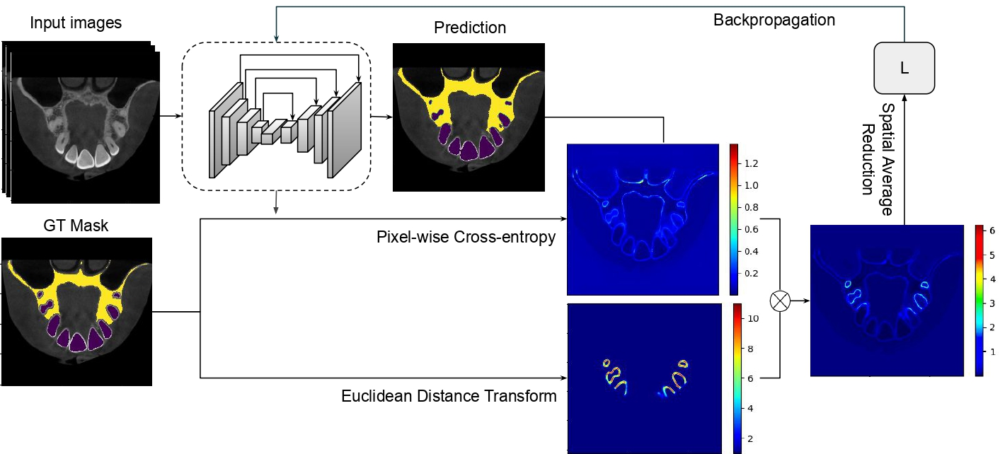
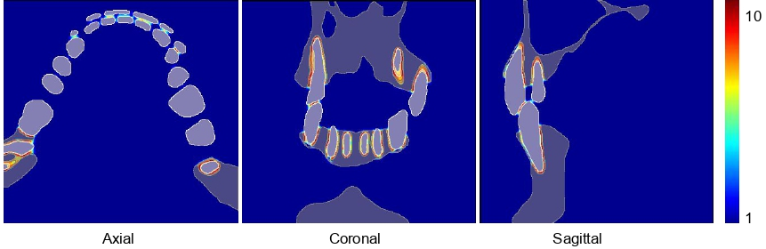
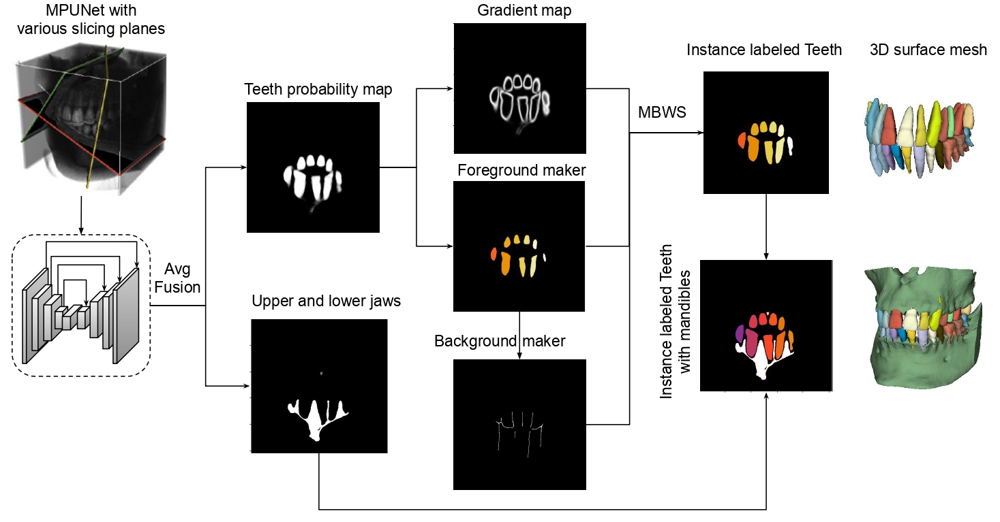

# Implementation of Paper: A simulation-friendly auto segmentation method for individual tooth and bones
##  Backbone model: Multi-Planar U-Net
Most of the repository is based on the official implemenation of original Multi-Planar U-Net.
Please follow https://github.com/perslev/MultiPlanarUNet for the general installation and usage of Multi-Planar U-Net

But make sure you clone from the current repository.

---

#  Teeth-bone Specific Pipeline with Transfer learning and Instance segmentation post-processing


## Initializing two projects, one for pretraining on inaccurate data, and one for fine-tuning as follows:

```
# Initialize a project for pretraining
mp init_project --name my_pretraining_project --data_dir ./pretraining_data_folder
# Initialize a project for pretraining
mp init_project --name my_finetune_project --data_dir ./fineune_data_folder
```

The YAML file named ```train_hparams.yaml```, which stores all hyperparameters will also be 
created for the two projects respectively. Any 
parameter in this file may be specified manually, but can all be set 
automatically. Please follow original MPUNet for the data format

---
## Pre-training
The model can now be pre-trained as follows:

```
cd my_pretraining_project
mp train --num_GPUs=1   # Any number of GPUs (or 0)
```

## Fine-tuning
The standard fine-tuning process without disatance weight map can be applied by invoking 
```
# make sure you are at root dir
cd my_finetune_project
mp train --num_GPUs=1 --overwrite --transfer_last_layer --force_GPU=0 \
--initialize_from '../my_pretraining_project/model/@epoch_xxx_val_dice_xxxx.h5'
```
Make sure you change ```xxx``` according to the .h5 file of the model generated from pre-training step 

### Fine-tuning with weight_map loss




To fine-tune with the weight_map loss for emphasizing the gap between teeth and bones in the loss function, 
make sure you first compute the weight_map based on the label maps of 
your training data. You can compute and store them by invoking the following command, but make sure you 
have modified the path to your fine-tuning dataset. You can also change the hyperparameters 
(std and erosion radius in the ```__main__``` function) 
```
python mpunet/preprocessing/weight_map.py
```

After the weight maps are stored on disk, you can fine-tune with weight_map loss by invoking
```
# make sure you are at root dir
cd my_finetune_project
mp train --num_GPUs=1 --overwrite \
--distance_loss --transfer_last_layer \
--distance_map_folder weight_maps \
--initialize_from '../my_pretraining_project/model/@epoch_xxx_val_dice_xxxx.h5'
```
Make sure you change ```xxx``` according to the .h5 file of the model generated from pre-training step 

### Fine-tuning with double weight_map loss
In order to enforce not only on gaps between teeth and bones, but also between neighboring teeth
to the loss function, 
we need to first label each tooth with a different integer from the ground truth. 
To do this, run 

```
python mpunet/preprocessing/instance_labelling.py
```
Note that this process can be very memory-consuming. Then, run the same command to compute the weigh map.
```
python mpunet/preprocessing/weight_map.py
```



### Interative Fine-tuning
To do Interative fine-tuning with the weight_map loss, make sure you first put the new training dataset to the data_dir,
then compute the weight_map based on the labels of 
your new training data. You can compute and store them by invoking the following command, but make sure you 
have modified the path to your fine-tuning dataset. You can also change the hyperparameters 
(std and erosion radius in the ```__main__``` function) 

```
python mpunet/preprocessing/weight_map.py
```

After the weight maps are stored on disk, you can fine-tune with weight_map loss by invoking the following, basically
remove ```--initialize_from``` and ```--transfer_last_layer```  tag and change ```--overwrite``` to ```--continue``` 

```
# make sure you are at root dir
cd my_finetune_project
mp train --num_GPUs=1 --continue --distance_loss \
--distance_map_folder weight_maps
```
Make sure you change ```xxx``` according to the .h5 file of the model generated from pre-training step 


## Predict
The trained model can now be evaluated on the testing data in 
```data_folder/test``` by invoking:

```
mp predict --num_GPUs=1 \
--force_GPU=0 \
--sum_fusion \
--overwrite \
--no_eval \
--by_radius \
--out_dir predictions 
```
note that the ```--sum_fusion``` tag is essential since we are not training 
another fusion model. ```--by_radius``` tage is also essential in ensuring different sampling strategy during training
and testing to avoid incomplete boundaries, as mentioned in the paper.

This will create a folder ```my_project/predictions``` storing the predicted 
images along with dice coefficient performance metrics.


## Individual Tooth Segmention with Post-Processing



The proposed watershed works on the UNet output probability map (for the teeth class). 
In order to get the fused (averaged) probability map (the softmax score) before argmax of MPUNet, 
run the following prediction command.
Note that ```save_single_class``` is the interger label for the teeth class, which is 2 in our case.

```
mp predict --num_GPUs=1 --save_single_class=2 \
--sum_fusion \
--overwrite --by_radius \
--no_eval --out_dir prob_maps \
--no_argmax
```


After you get the probability maps, run the following to get different labels for each tooth. 

```
python instance_seg/watershed
```
Default hyperprameters are given in the main function 
but will probably need to be adapted for specific use case, e.g., the ```open``` radius.
Note that they denote number of voxels, so will probably also need to adapt to new voxel sizes.


The ```watershed``` will only work on the teeth class until the very end, where 
it will combine with the bone class that was generated by the ```mp predict``` command 
without the argument ```--no_argmax```. Therefore, please also make sure that 
the integer results are stored

The bone class labels with 1. A straightforward Connected Component Decomposition while keeping the largest two
components to remove small disconnected false positives suffice to further separate maxilla and mandibles.
You can do this by running
```
python postprocessing/ccd
```


## Evaluate/Numerical Validation
The results can be evaluated on the testing data to get DICE, GapDICE, and Hausdoff Distance, and ASSD by running

```
python mpunet/evaluate/compute_metrics.py 
```

This will print the mean and standard deviation for the 4 metrics, as well as generate .csv files for the score for each image. You can use simple a script or
Excel functions to get the mean and std of the overall performance


## Final Finite Element Model

Much of the motivation of this project is under a larger project: Open-Full-Jaw: An open-access dataset and pipeline for finite element models of human jaw

available at https://github.com/diku-dk/Open-Full-Jaw

The auto segmentation of teeth and bones is the essential first step to generate patient-specific 
jaw finite element model for simulation studies. 

The generated surface mesh via marching cubes algorithm over the auto segmentation results is under the folder ```RawSegment```. 

The cleaning and remeshing can be applied automatically following the instruction. 
These operations are necessary to remove too dense or irregular triangles, 
which is usually due to the artefacts from marching cubes rather than segmentation qualities. 

The cleaned surface mesh from ```RawSegment``` is under ```CleanSegment``` folder in .obj format. 
Please refer to the ```CartiGen``` and later folders for the generated cartilage and the simulation results on it.

[](https://github.com/diku-dk/Open-Full-Jaw)